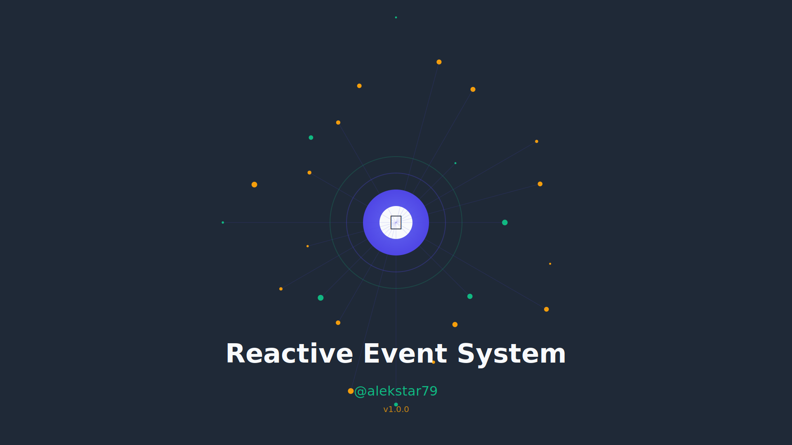

# Reactive Event System

[](https://www.npmjs.com/package/@alekstar79/reactive-event-system)
[](https://github.com/alekstar79/reactive-event-system)
[]()
[]()
[]()
[]()

High-performance reactive event bus with batched updates, middleware support, and streaming capabilities. Built for TypeScript with full type safety and ES2024 compatibility.



<!-- TOC -->
* [Reactive Event System](#reactive-event-system)
  * [Features](#features)
  * [Installation](#installation)
    * [npm](#npm)
    * [yarn](#yarn)
    * [pnpm](#pnpm)
  * [Quick Start](#quick-start)
    * [Basic Usage](#basic-usage)
    * [One-time Events](#one-time-events)
    * [Promise-based Event Waiting](#promise-based-event-waiting)
    * [Reactive Streams](#reactive-streams)
    * [Middleware Pipeline](#middleware-pipeline)
    * [Event Piping](#event-piping)
    * [Metrics and Monitoring](#metrics-and-monitoring)
    * [Error Handling](#error-handling)
    * [Utility Methods](#utility-methods)
  * [Typed Events](#typed-events)
  * [API Reference](#api-reference)
    * [ReactiveEventSystem](#reactiveeventsystem)
      * [Constructor](#constructor)
      * [Methods](#methods)
  * [TypeScript Support](#typescript-support)
  * [Browser Support](#browser-support)
  * [Performance](#performance)
  * [Testing](#testing)
  * [📊 Test Coverage](#-test-coverage)
  * [Contributing](#contributing)
  * [License](#license)
  * [Related Projects](#related-projects)
  * [Changelog](#changelog)
  * [Security](#security)
<!-- TOC -->

## Features

- 🚀 **High Performance**: Batched reactive updates for minimal re-renders
- 🔄 **Reactive**: Seamless integration with reactive state management
- 🔗 **Middleware Pipeline**: Flexible event processing with global and event-specific middleware
- 📡 **Event Streaming**: Convert events to reactive streams with built-in metrics
- ⏱️ **Promise-based**: `waitFor()` method for async event handling with timeout support
- 🔀 **Event Piping**: Route events from one bus to another with optional transformation
- 📊 **Metrics**: Built-in monitoring with reactive metrics tracking
- 📦 **Tree-shakeable**: Fully modular, ES2022+ compatible
- 💪 **Type Safe**: Complete TypeScript support with generics

## Installation

### npm

```bash
npm install @alekstar79/reactive-event-system
```

### yarn

```bash
yarn add @alekstar79/reactive-event-system
```

### pnpm

```bash
pnpm add @alekstar79/reactive-event-system
```

## Quick Start

### Basic Usage

```typescript
import ReactiveEventSystem from '@alekstar79/reactive-event-system'

// Create a bus instance
const bus = new ReactiveEventSystem()

// Subscribe to events
bus.on('message', (data) => {
  console.log('Message received:', data)
})

// Emit events
bus.emit('message', { text: 'Hello, World!' })

// Unsubscribe (automatic)
const unsubscribe = bus.on('message', (data) => {
  console.log('Handler 1:', data)
})
unsubscribe()
```

### One-time Events

```typescript
// Listen for event only once
bus.once('connected', (data) => {
  console.log('Connected:', data)
})

// Alternatively, with unsubscribe function
const unsubscribe = bus.once('connected', (data) => {
  console.log('Connected:', data)
})
```

### Promise-based Event Waiting

```typescript
// Wait for specific event with timeout
try {
  const user = await bus.waitFor('authComplete', 5000)
  console.log('Authenticated:', user)
} catch (error) {
  console.log('Auth timeout')
}

// Wait without timeout
const data = await bus.waitFor('dataLoaded')
```

### Reactive Streams

```typescript
import { effect } from '@alekstar79/reactive-event-system'

// Create a stream from events
const messageStream = bus.stream('messages')

// React to stream updates
effect(() => {
  console.log('Latest message:', messageStream.state.value)
  console.log('Total messages:', messageStream.state.count)
})

// Subscribe to stream
const unsubscribe = messageStream.subscribe((msg) => {
  console.log('Stream listener:', msg)
})

// Cleanup
messageStream.destroy()
```

### Middleware Pipeline

```typescript
// Global middleware (all events)
bus.use('*', (data, event) => {
  console.log(`Event: ${event}`, data)
  return data
})

// Event-specific middleware
bus.use('userAction', (data, event) => {
  if (!data.userId) {
    throw new Error('userId is required')
  }
  // Transform data
  return {
    ...data,
    timestamp: Date.now(),
    processed: true
  }
})

// Multiple middleware chains
const unsubscribe = bus.use('userAction', (data) => {
  return { ...data, validated: true }
})
```

### Event Piping

```typescript
const sourceBus = new ReactiveEventSystem()
const targetBus = new ReactiveEventSystem()

// Pipe events from source to target
const unpipe = sourceBus.pipe('data', targetBus)

// Pipe with event name transformation
const unpipeRenamed = sourceBus.pipe('input', targetBus, 'processedInput')

// Stop piping
unpipe()
```

### Metrics and Monitoring

```typescript
import ReactiveEventSystem, { effect } from '@alekstar79/reactive-event-system'

// Enable metrics on initialization
const bus = new ReactiveEventSystem({ enableMetrics: true })

// Get metrics object
const metrics = bus.getMetrics()

// Monitor metrics reactively
effect(() => {
  console.log('Total events emitted:', metrics.state.totalEventsEmitted)
  console.log('Last event:', metrics.state.lastEmittedEvent)
  console.log('Active listeners:', metrics.state.activeListeners)
  console.log('Total listeners:', metrics.totalListeners())
  console.log('Event names:', metrics.events())
})
```

### Error Handling

```typescript
// Custom error handler
const bus = new EventBusReactiveEventSystem({
  errorHandler: (error, event, listener) => {
    console.error(`Error in listener for "${event}":`, error.message)
    // Custom error reporting, logging, etc.
  }
})

// Listen for events
bus.on('test', () => {
  throw new Error('Something went wrong')
})

// Event is still emitted, error is handled
bus.emit('test', {})
```

### Utility Methods

```typescript
// Check listener count
const count = bus.listenerCount('message')
console.log('Listeners:', count)

// Check if event has listeners
if (bus.hasListeners('message')) {
  bus.emit('message', { text: 'Someone is listening' })
}

// Get all event names
const eventNames = bus.eventNames()
console.log('Events:', eventNames)

// Remove all listeners for specific event
bus.removeAllListeners('message')

// Remove all listeners for all events
bus.removeAllListeners()

// Cleanup resources
bus.destroy()
```

## Typed Events

```typescript
interface UserEventData {
  userId: string
  username: string
  email: string
}

// Create typed bus
const userBus = new ReactiveEventSystem<UserEventData>()

// TypeScript enforces correct data structure
userBus.on('userCreated', (data) => {
  console.log(data.userId) // ✓ OK
  console.log(data.username) // ✓ OK
  // console.log(data.unknown) // ✗ Error: Property 'unknown' does not exist
})

userBus.emit('userCreated', {
  userId: '123',
  username: 'john',
  email: 'john@example.com'
})
```

## API Reference

### ReactiveEventSystem

Main class for event bus functionality.

#### Constructor

```typescript
constructor(options?: {
  enableMetrics?: boolean
  errorHandler?: (error: Error, event: string, listener: Function) => void
})
```

#### Methods

- `on(event, listener, options?)`: Subscribe to event
- `once(event, listener, options?)`: Subscribe to event once
- `off(event, listener)`: Unsubscribe from event
- `emit(event, data)`: Emit event to all listeners
- `listenerCount(event)`: Get listener count for event
- `removeAllListeners(event?)`: Remove all listeners
- `eventNames()`: Get all event names
- `hasListeners(event)`: Check if event has listeners
- `use(event, middleware)`: Add middleware
- `stream(event)`: Create reactive stream
- `getMetrics()`: Get metrics object
- `waitFor(event, timeout?)`: Wait for event (Promise)
- `pipe(fromEvent, toEmitter, toEvent?)`: Pipe events
- `destroy()`: Cleanup resources

## TypeScript Support

Full TypeScript support with complete type definitions included.

```typescript
import ReactiveEventSystem, { EventSystemMetrics, EventStream, EventMiddleware } from '@alekstar79/reactive-event-system'

interface AppEvents {
  ready: { timestamp: number }
  error: { message: string }
  data: { value: string }
}

type AppBus = ReactiveEventSystem<AppEvents>
```

## Browser Support

- Chrome: ✓ Latest
- Firefox: ✓ Latest
- Safari: ✓ Latest
- Edge: ✓ Latest

Requires ES2024 support or transpilation.

## Performance

- Batched reactive updates minimize re-renders
- WeakMap-based cleanup prevents memory leaks
- Set-based listener storage for O(1) operations
- Minimal overhead for event emission

## Testing

```bash
npm test
npm run test:coverage
npm run test:ui
```

## 📊 Test Coverage

| File      | % Stmts | % Branch | % Funcs | % Lines |
|-----------|---------|----------|---------|---------|
| All files | 79.31   | 75       | 69.09   | 80.48   |
| index.ts  | 79.31   | 75       | 69.09   | 80.48   |

## Contributing

Contributions are welcome! Please read our contributing guidelines first.

## License

MIT © 2025 @alekstar79

## Related Projects

- [@alekstar79/reactivity](https://github.com/alekstar79/reactivity) - Reactive state management

## Changelog

See [CHANGELOG.md](CHANGELOG.md) for release history.

## Security

For security issues, please email instead of using the issue tracker.
